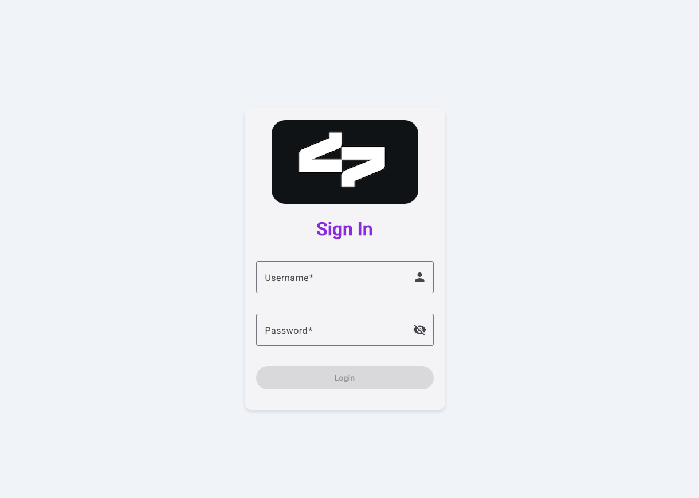
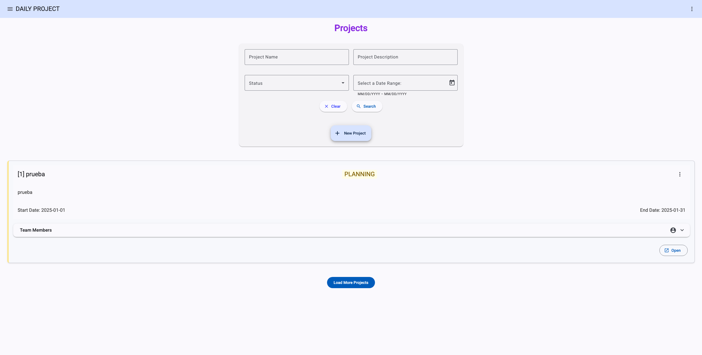
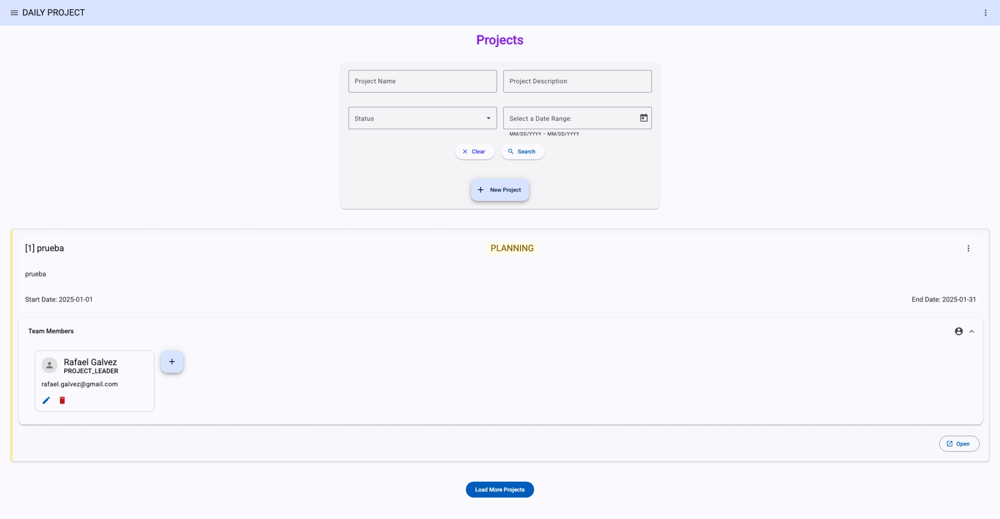
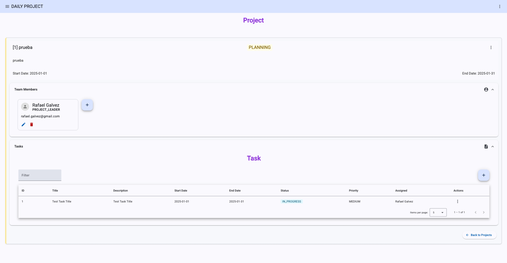
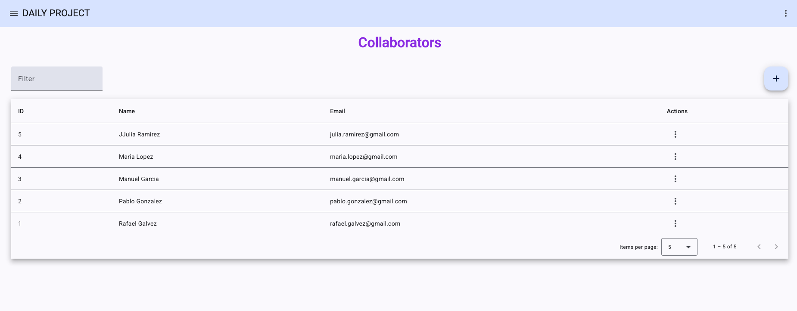
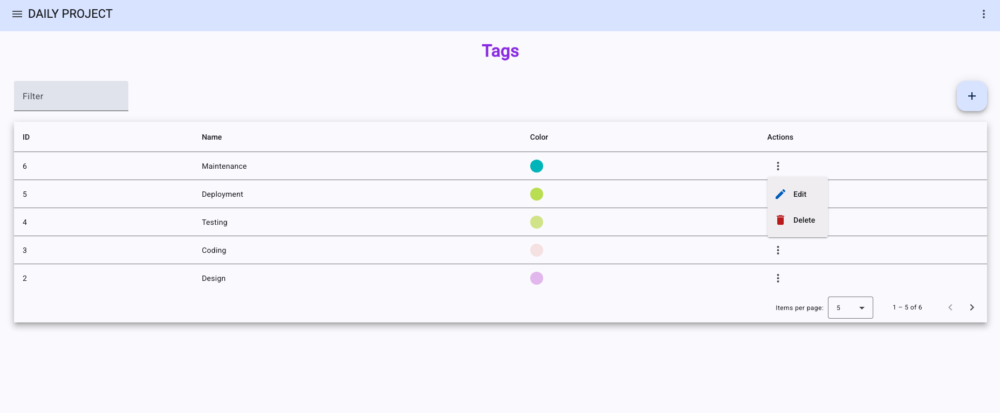

# Daily Project Frontend
Daily Project Frontend is an Angular application designed to manage projects, tasks, collaborators, and permissions. It consumes the RESTful API provided by the Daily Project backend and offers a responsive user interface using Angular Material Design.

## Technologies Used
- **Angular 18.2.1**
- **Angular Material Design**
- **TypeScript**
- **RxJS** for reactive programming.
- **NgRx** for state management.
- **@auth0/angular-jwt 5.2.0** for JWT handling.

## Key Features
1. **Authentication and Authorization:**
   - JWT-based authentication integrated with the backend.
   - Role-based access control (RBAC).
2. **Project and Task Management:**
   - CRUD for projects, tasks, collaborators, and tags.
   - Role assignment for project collaborators.
   - Task change tracking and state management.
3. **UI Components:**
   - Angular Material components for a modern UI.
   - Responsive design for various screen sizes.
4. **Routing and Navigation:**
   - Angular Router for page navigation.
   - Route guards for secure navigation.

## Requirements to Run the Project
- Node.js (version 18 or higher)
- **Interceptors:** Implemented for JWT token injection and error handling.

## Installation and Setup
1. Clone the repository:
   ```bash
   git clone https://github.com/rafaelgalvezg/daily-project-web.git
   ```
2. Navigate to the project directory:
   ```bash
    cd daily-project-frontend
    ```
3. Install the dependencies:
    ```bash
    npm install
    ```
4. Run the application:
    ```bash
    ng serve
    ```
5. Open the browser and navigate to `http://localhost:4200/` to view the application.

**Note:** The application requires the backend API to be running. Make sure to start the backend server before running the frontend application.
- [Daily Project Backend Repository](https://github.com/rafaelgalvezg/daily-project-api.git)

## Pending Tasks (Backlog)
- Implement unit tests.
- Implement end-to-end tests.
- Design and implement the dashboard for project overview and task tracking
- Improve task management views.


## System Screenshots
### Login View

### Project Management View

### Project Management Member Team View

### Project Task Management View

### Collaborator Management View

### Tag Management View



## License
This project is licensed under the MIT license. See the `LICENSE` file for more details.

